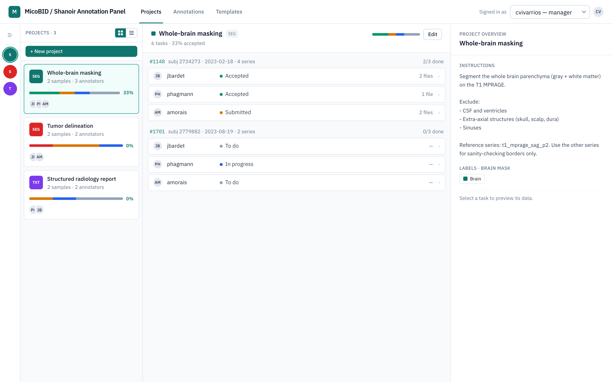
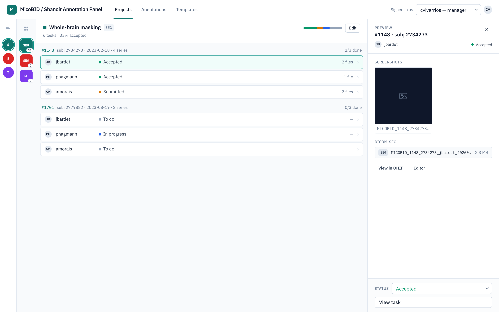
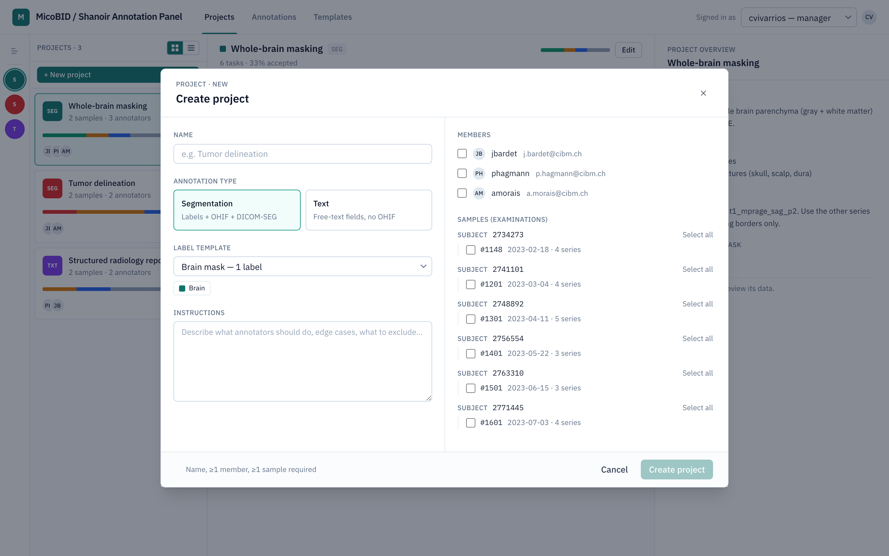
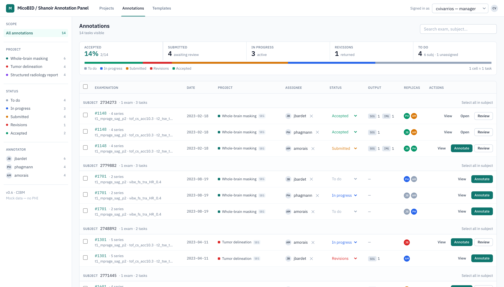
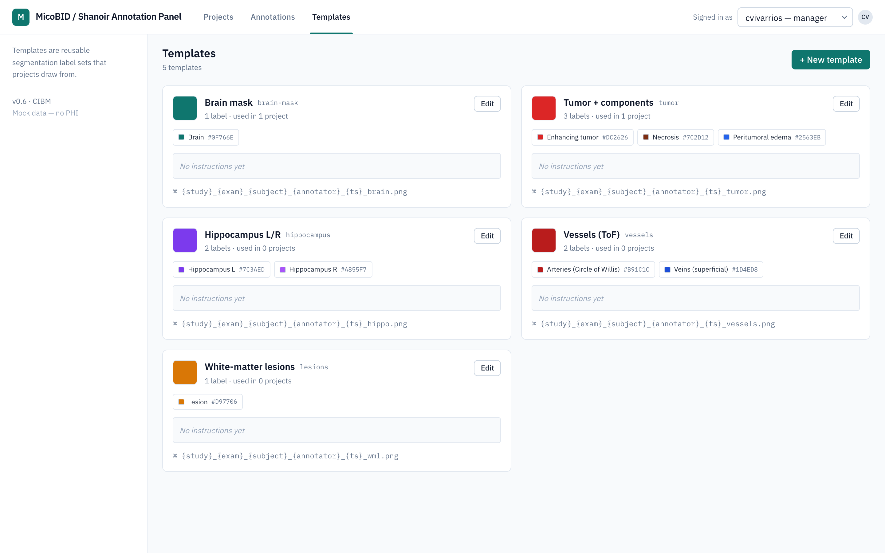

# MicoBID / Shanoir Annotation Panel

A web UI for managing annotation tasks across Shanoir + OHIF — built to be
embedded in VIP as a button before annotation, or to provide deep links into
OHIF once an annotator is logged in.

## Screens

All views below run on mock data — no PHI. Signed in as a manager.

### Projects workspace

The manager's home. A collapsing multi-pane layout: outline → project list →
tasks of the selected project → a preview of the selected task.



Selecting a task opens the preview pane — screenshots, DICOM-SEG files, status,
and deep links into OHIF.



### Create / edit a project

Pick an annotation type (segmentation with a label template + OHIF, or free-text
fields), assign members, and choose which Shanoir examinations to sample.



### Annotations

The flat task list across every project, with faceted filters (scope, project,
status, annotator), per-subject grouping, and manager review actions.



### Templates

Reusable segmentation label sets that segmentation projects draw from.



## Run

```sh
# 1. Create your credentials file
cp caddy/auth.env.example caddy/auth.env

# 2. Generate a bcrypt hash for your password
docker run --rm caddy:2-alpine caddy hash-password --plaintext 'your-password'

# 3. Paste the hash into caddy/auth.env as BASIC_AUTH_HASH, then bring it up
docker compose up -d --build

# 4. Open http://localhost:8080  (basic auth: admin / your-password)
```

`caddy/auth.env` is gitignored. Update `BASIC_AUTH_USER` / `BASIC_AUTH_HASH`
to rotate credentials and `docker compose restart caddy` to apply.

## Architecture

```
host:8080  →  caddy (basic auth)  →  app:5173  (Vite + React)
```

### Why Caddy?

The app itself is just a Vite dev server. On its own it has **no login and no
password** — anyone who can reach it can open it. That's fine on your laptop,
but the moment this runs on a shared machine or a server with a public IP, an
open dev server is a problem: search engines and scanners find it, and there's
nothing stopping a stranger from poking at it.

Caddy is a small web server that sits **in front of** the app and solves that in
plain terms:

- **It adds a password gate.** Caddy asks for a username and password (HTTP
  Basic Auth) before letting anyone through. No correct password, no app. This
  is how we can hand out a demo link without also handing out open access.
- **It's the only door.** In `docker-compose.yml` the app container has *no*
  host port — you cannot reach `app:5173` from your machine directly. The only
  way in is through Caddy on port `8080`. So the password can't be skipped by
  going around it.
- **It handles the plumbing.** Caddy gzip-compresses responses and forwards the
  WebSocket connection that Vite uses for hot-reload, so the dev experience
  still works normally behind the gate.

We use Caddy specifically because this setup is tiny: the whole config is a few
lines (see `caddy/Caddyfile`), and password auth is built in — no plugins, no
extra services, no certificates to manage for a simple internal demo. If we
later put this behind a real domain, Caddy can also fetch HTTPS certificates
automatically, but that isn't needed today.

Credentials live in `caddy/auth.env` (gitignored), which is why the password is
never committed to the repo — see the setup steps above.

## Layout

```
app/                  React app (Vite + Tailwind)
  src/
    components/       Masthead, Sidebar, Overview, TaskTable, BulkActionBar,
                      ProjectsWorkspace, ProjectEditor, TemplatesView,
                      TemplateEditor, ReviewDrawer, AnnotateModal
    data/mockData.js  Mock Shanoir study, users, series, tasks, templates
caddy/
  Caddyfile           Reverse proxy + basic auth
  auth.env.example    Credentials template (copy to auth.env, gitignored)
docs/
  static/             Screenshots used in this README
docker-compose.yml    Two services: app + caddy
```
